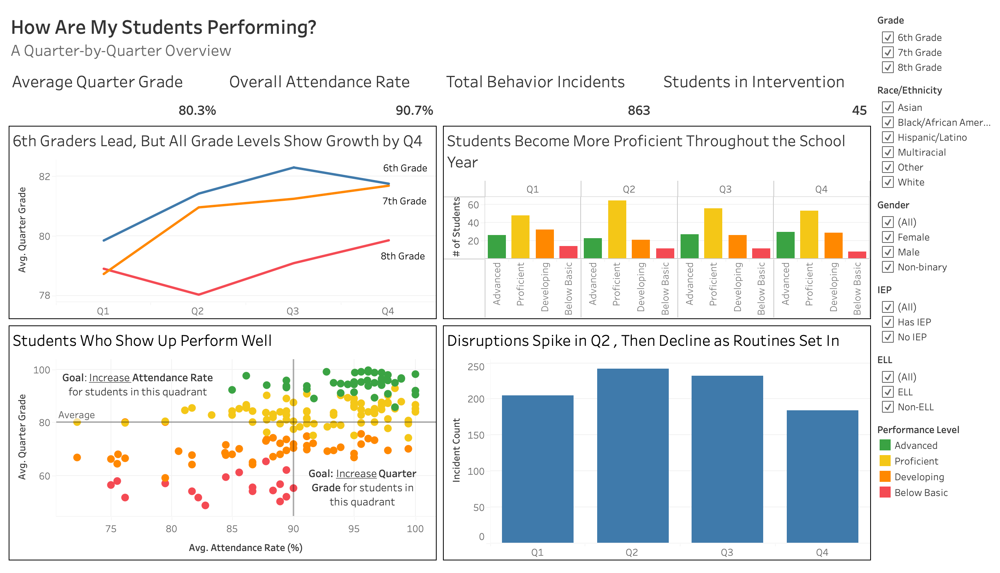
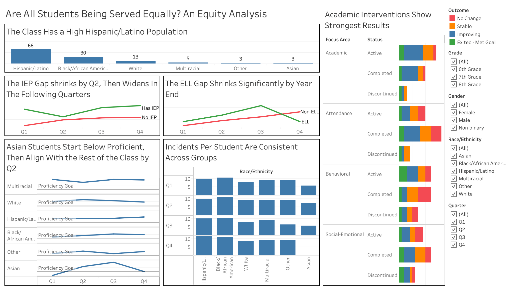
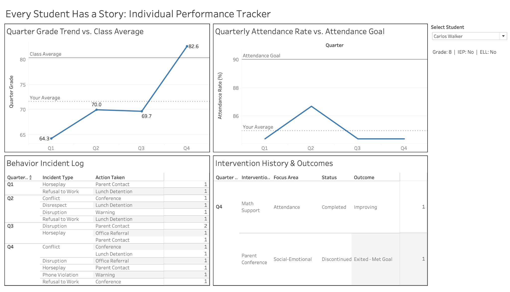

# Tableau Dashboard

This folder contains the packaged Tableau workbook and a dashboard preview for
the Student Performance Analytics project.

## Dashboard Views

1. Quarterly Overview
2. Equity and Subgroup Analysis
3. Individual Student Overview

## Packaged Workbook

[Download the Tableau workbook](Student%20Performance%20Dashboard.twbx)

The `.twbx` file embeds the Excel source data so it can be opened without
reconnecting to a local file path. Filters and dashboard actions are available
in Tableau.

## Dashboard Preview

### Quarterly Overview

### Equity and Subgroup Analysis

### Individual Student Overview

## Design Notes

- Four KPI cards summarize grades, attendance, behavior, and interventions.
- Filters support grade-level and subgroup review without changing the source
  data.
- Dashboard actions connect school-wide trends to individual student details.
- Subgroup findings are interpreted alongside sample sizes.
- Attendance and performance patterns are presented as associations, not causal
  relationships.
